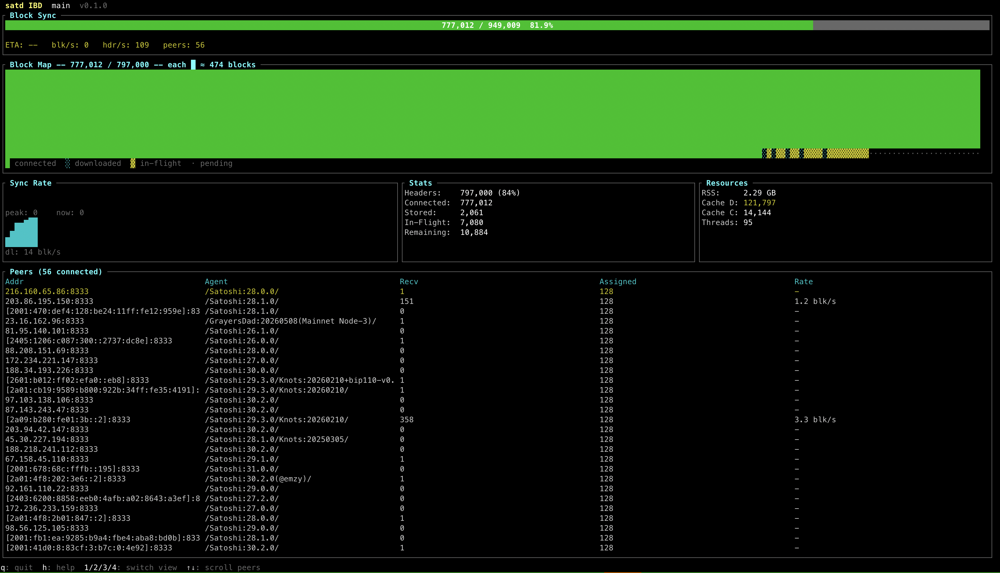

<div align="center">


<h1>satd</h1>

<p><strong>A Bitcoin Core-compatible full node in Rust.</strong></p>

<p><em>One process. One RocksDB. One systemd unit.</em></p>

<p>
  <a href="LICENSE"></a>
  <a href="https://github.com/epochbtc/satd/releases"></a>
  <a href="https://github.com/epochbtc/satd/actions/workflows/ci.yml"></a>
  <a href="https://www.rust-lang.org"></a>
  <a href="https://epochbtc.github.io/satd/"></a>
</p>

<p>
  <a href="https://epochbtc.github.io/satd/"><b>Operator Manual</b></a> &nbsp;·&nbsp;
  <a href="MANIFESTO.md">Manifesto</a> &nbsp;·&nbsp;
  <a href="CORE_DIFFERENCES.md">Core Differences</a> &nbsp;·&nbsp;
  <a href="ROADMAP.md">Roadmap</a> &nbsp;·&nbsp;
  <a href="CHANGELOG.md">Changelog</a> &nbsp;·&nbsp;
  <a href="#getting-started">Getting Started</a>
</p>

</div>

<p align="center">
<code>satd</code> provides the core node, plus the wallet-server protocols operators usually wire up alongside it (Esplora REST, Electrum, BIP&nbsp;157/158).
</p>

---

## Why satd?

*   **Node Sovereignty:** `satd` puts relay policy back in the operator's hands. Every mempool and relay decision is a first-class, exposed flag — filter spam, cap or disable `OP_RETURN` data carriers, tune dust thresholds and ancestor/descendant limits, and decide for yourself what your node accepts and rebroadcasts (`-datacarrier`, `-datacarriersize`, `-dustrelayfee`, `-permitbaremultisig`, `-limitancestorcount`) — all without running a patched fork. A memory-safe Rust implementation gives economic node operators a robust alternative to the C++ monoculture, strengthening the network's resilience. Read the [Manifesto](MANIFESTO.md).
*   **Built for the Operator:** Eliminates the `bitcoind` + `electrs` + `esplora` multi-process headache — everything shares a single chainstate and a single RocksDB instance — and ships the operational surfaces you'd otherwise bolt on yourself: native Prometheus `/metrics` and `/healthz` with structured logs, a capability-scoped authentication system (cookie, user/pass, or bearer-token `-authfile`, with native TLS/mTLS on every listener), API scaling knobs that isolate read-only RPC onto a dedicated runtime behind admission control (`--api-threads`), and an optional MCP server that exposes node data and ops surfaces directly to AI agents.
*   **Zero Consensus Divergence (Dual Engine):** Run the independent Rust consensus engine, the C++ `libbitcoinconsensus` engine, or both at once with runtime shadow-validation — every script cross-checked against Core (genesis→~945k, zero divergence). See [Consensus & Network](#consensus--network) below for the differential test battery that holds the full block-acceptance pipeline to Core.

## Features

### Consensus & Network
*   **Dual Consensus Engine:** A complete, independently written Rust consensus engine that passes the Bitcoin Core test suite, with a C++ `libbitcoinconsensus` conservative fallback and runtime script-level shadow validation between the two.
*   **Differential Block-Acceptance Testing:** Beyond script verification, the full block-acceptance pipeline (PoW, merkle/witness commitments, sigops, BIP 34, value conservation, maturity, timestamps, locktime/BIP 68) is checked against Core by static fixtures ported from Core's own tests and a generative fuzzer that dual-submits adversarial blocks to `satd` and a live `bitcoind`.
*   **Swarm-Style IBD:** BitTorrent-like parallel block downloading and speculative verification pipeline for heavily optimized Initial Block Download.
*   **Full P2P:** BIP 152 compact blocks, ban scoring, addrv2, BIP 324 v2 encrypted transport (`-v2transport`, on by default; opt-in `-v2only` anti-surveillance mode), Tor v3 (hardcoded `.onion` seeds), SOCKS5 `-proxy`.
*   **Policy Sovereignty (Mempool):** Strict, first-class control over what your node relays. Easily filter spam, block `OP_RETURN` data, or adjust limits via exposed flags (`-datacarrier`, `-datacarriersize`, `-dustrelayfee`, `-limitancestorcount`, `-permitbaremultisig`) without needing a patched fork.
*   **Modern Mempool:** Full RBF / opt-in BIP 125 and CPFP ancestor tracking.

### Native Integrations (No side-cars required)
*   **Native TLS Support:** Direct TLS support for JSON-RPC, Electrum, and Esplora servers, eliminating the need for Nginx/reverse-proxy sidecars.
*   **AI-Native MCP Server:** An optional Model Context Protocol (`mcp`) binary that exposes node data and operational surfaces directly to AI agents.
*   **Electrum Protocol:** Native TCP server (v1.4.5) for wallets like BlueWallet, Sparrow, and Nunchuk.
*   **Esplora REST:** Wire-shape parity with blockstream.info / mempool.space for the implemented endpoint set.
*   **Compact Block Filters:** Native BIP 157/158 index and P2P service for embedded-Neutrino mobile wallets (Zeus, Blixt, Mutiny).
*   **Shared Indexing:** Address-history index atomic with `connect_block`. One database powers everything.

### Operator Ergonomics

<details>
<summary><b>View the satd Terminal UI</b></summary>


*The `sat-tui` interface provides real-time observability, including an IBD bitmap, peer stats, and a JSON-RPC explorer.*
</details>

*   **Native TUI (`sat-tui`):** A beautiful Ratatui-based terminal interface for real-time IBD bitmap visualization, peer stats, and node observability.
*   **Metrics & Observability:** Native Prometheus `/metrics`, `/healthz`, and JSON-structured logs.
*   **Core-Compatible:** Accepts standard `bitcoin.conf` and CLI flags (`-prune`, `-txindex`, `-assumevalid`). Uses standard `.cookie` auth. AssumeUTXO fast-sync is supported via the `loadtxoutset` RPC (Core's snapshot files load directly). *Note: While AssumeUTXO support is fully implemented and compatible with existing commonly-distributed snapshots, we do not create or distribute these snapshots ourselves; users must find their own source for trusted snapshots.*
*   **Mempool Stream:** `subscribemempool` JSON-RPC WS subscription with explicit eviction/replacement reasons.
*   **Events Bus:** gRPC + ZMQ publishers for chain and mempool events (`satd-events`).
*   **Reorg Logging:** Persistent reorg log with an optional webhook.

*(See [`CORE_DIFFERENCES.md`](CORE_DIFFERENCES.md) for a full catalog of intentional deviations and features explicitly out of scope, such as the legacy wallet).*

---

## Getting Started

### Building

Requires Rust (stable, edition 2024), a C/C++ compiler, and clang/LLVM libraries (for `rocksdb-sys` bindgen).

```sh
./configure          # detect dependencies, generate .cargo/config.toml
cargo build
```

**Consensus-only build** (no BIP 158 codec, no Esplora handlers, no Electrum protocol code):
```sh
cargo build -p satd --no-default-features
```

**Reproducible build via Nix** (deterministic across hosts; toolchain pinned in `rust-toolchain.toml`):
```sh
nix build .#satd     # produces ./result/bin/{satd, sat-cli}
```
*See the [Operator Manual → Packaging](https://epochbtc.github.io/satd/packaging.html#reproducible-build-via-nix) for the full story.*

### Running

```sh
# Regtest — quick local node
cargo run --bin satd -- --regtest

# Mainnet — Esplora and address index on by default
cargo run --bin satd -- --datadir=/path/to/datadir

# Add the Electrum server (loopback; expose via Tor)
cargo run --bin satd -- --electrum=1

# Add BIP 157/158 P2P service for embedded-Neutrino wallets
cargo run --bin satd -- --blockfilterindex=basic --peerblockfilters=1
```

### Querying & Stopping
```sh
cargo run --bin sat-cli -- --regtest getblockchaininfo
cargo run --bin sat-cli -- --regtest getindexinfo
cargo run --bin sat-cli -- --regtest getserverstatus
cargo run --bin sat-cli -- --regtest stop
```

## Configuration

Bitcoin Core-compatible flags (`-regtest`, `-datadir`, `-rpcport`, `-prune`, `-txindex`, `-assumevalid`, `-includeconf`, …) and the `bitcoin.conf` file format are accepted as the default surface. Core's CLI/config compatibility surface is now complete — every recognized `bitcoin.conf` key is either honored or recognize-rejected with a clear message (no silent accept-and-ignore).

Bundled `--profile=<preset>` selects from `archival`, `pruned-home`, `mining`, `regtest-dev`, and `signet-watchtower`. CLI flags override profile values; `getconfig` / `sat-cli node config` shows the effective post-merge configuration.

Authentication uses a cookie file (default) or `--rpcuser` / `--rpcpassword`. The Esplora listener defaults to **unauthenticated loopback**; for non-loopback exposure, set `--esploraauth=cookie` or `--esploraauth=userpass`.

*See the [Operator Manual](https://epochbtc.github.io/satd/) for the full flag matrix and tuning notes — in particular the [Configuration Flag Reference](https://epochbtc.github.io/satd/config-reference.html).*

---

## Repository Layout

```text
satd/                         Daemon binary — config, lifecycle, wiring
sat-cli/                      CLI client — Bitcoin-Core-compatible RPC client
sat-tui/                      Ratatui-based ops TUI
node/                         Core library (chain, storage, mempool, P2P, RPC, validation)
node-index/                   Address-history index over the shared RocksDB
node-filter-index/            BIP 158 compact-block-filter index
esplora-handlers/             Native Esplora-compatible REST
electrum-proto/               Native Electrum protocol server (vendored from electrs)
events/                       Event-bus sinks (gRPC + ZMQ)
mcp/                          MCP tools over the ops-surface RPCs
consensus/                    Rust script-verifier shadow
block-analyzer/               Standalone tool for offline block analysis
docs/                         API + integration docs
```

## Documentation

| Resource | Purpose |
|---|---|
| [**Operator Manual**](https://epochbtc.github.io/satd/) | mdbook reference for operators, integrators, and packagers: observability, configuration & live reload, the full config-flag reference, integrator APIs, the `sat-tui`, the Esplora REST and streaming APIs, the native protocol-surface architecture, and packaging. Source under [`docs/manual/`](docs/manual/). |
| [`MANIFESTO.md`](MANIFESTO.md) | Node Sovereignty, the monoculture risk, and the conservative BIP policy. |
| [`CORE_DIFFERENCES.md`](CORE_DIFFERENCES.md) | Catalog of intentional deviations from Bitcoin Core: native surfaces, exclusions, and behavioral defaults. |
| [`STABILITY_POLICY.md`](STABILITY_POLICY.md) | Tiered stability contract; deprecation policy; canary CI. |
| [`ROADMAP.md`](ROADMAP.md) | Upcoming operator features and the ecosystem / mobile-integration strategy (unshipped, tagged by likelihood). |
| [`docs/api/streaming.md`](docs/api/streaming.md) | Streaming Consumption API — authoritative wire-level protocol spec. |
| [`docs/E2E_TESTING.md`](docs/E2E_TESTING.md) | End-to-end suite: how to run, timeout knobs, flake-gate workflow. |
| [`SECURITY.md`](SECURITY.md) | Supported versions and how to report a vulnerability. |
| [`CONTRIBUTING.md`](CONTRIBUTING.md) | Branch/PR workflow, CI gates, and review expectations. |

## License

MIT — see [`LICENSE`](LICENSE) for the full text.

*Vendored code from `romanz/electrs` (MIT) is attributed in `electrum-proto/vendor/electrs.MIT` with original LICENSE text preserved.*
